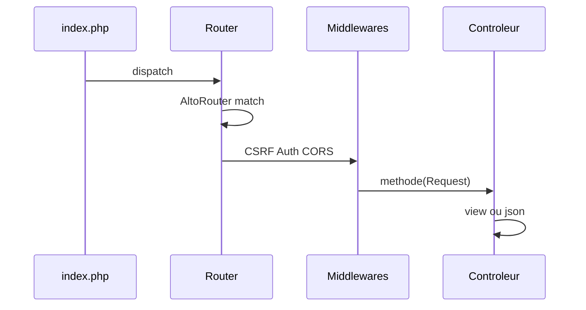

# Cours — Framework MVC pédagogique

Support de cours à suivre **dans l’ordre**. On ouvre les fichiers cités en même temps. PHP cible : **^8.2**. Installation : [README](../README.md).

---

## 1. Présentation

Ce projet est un **MVC minimal** :

- **M**odèle : une classe PHP = une table SQL. Résultat = **tableaux**, pas d’objets magiques.
- **V**ue : Twig, uniquement pour le web (`app/Web/Views/`).
- **C**ontrôleur : reçoit une `Request`, parle au modèle, rend HTML ou JSON.

**Volontairement absent** (pour que le SQL et le HTTP restent visibles) :

- pas d’ORM (`hasMany`, `belongsTo`, `save()` magique) ;
- pas de facades statiques ;
- pas de « service providers » en cascade ;
- pas de classe `Response` : le rendu est dans `Controller::view()` et `ApiController::json()`.

**À retenir :** si on ne voit pas le SQL, on n’a pas compris la couche données.

---

## 2. Installation

Voir le README. Points de cours :

- **XAMPP** : le site est dans un sous-dossier (`/framework`). La variable `.env` `APP_BASE_PATH=/framework` préfixe les liens, le CSS et les redirections.
- **`.htaccess` racine** : envoie tout vers `public/` (on n’expose pas `app/`, `config/`, `.env`).
- **`public/.htaccess`** : front controller (`index.php`).
- Si l’ancienne table `users` n’a pas `password_hash` : **DROP DATABASE** puis `php framework migrate`.

**Piège :** oublier `APP_BASE_PATH` sous XAMPP casse le CSS et les formulaires.

---

## 3. Arborescence

```
public/index.php      entrée HTTP unique
config/routes_web.php  routes HTML
config/routes_api.php  routes JSON /api
config/services.php    bindings du conteneur
config/database.php    DSN via Env
core/                  moteur (à commenter / lire)
app/Web/               pages Twig
app/Api/               JSON
app/Models/            tables SQL
app/DTO/               entrée (validation) et sortie (contrat JSON / Twig)
app/Auth.php           session + jetons API
app/Middleware/
database/migrations/   SQL brut up()/down()
framework              CLI
docs/cours.md          ce fichier
```

Namespaces Composer : `App\` → `app/`, `Core\` → `core/`, `Console\` → `console/`.

---

## 4. Cycle de vie d’une requête

Fichier : [`public/index.php`](../public/index.php).

1. `BASE_PATH` = racine du projet (un cran au-dessus de `public/`).
2. Autoload Composer.
3. **`Env::load('.env')` en premier** (base, préfixe d’URL).
4. `session_start()` (flash, CSRF, `user_id`).
5. Conteneur + `config/services.php`.
6. Handlers d’erreur : HTML 500 ou JSON si le chemin est `/api`.
7. `Router::dispatch()`.



---

## 5. Environnement et config

[`core/Env.php`](../core/Env.php) parse `KEY=value` sans bibliothèque externe.

[`config/database.php`](../config/database.php) lit `DB_HOST`, `DB_NAME`, etc. Défauts = XAMPP (`root`, mot de passe vide).

**À retenir :** jamais de mot de passe en dur dans le PHP ; tout passe par `.env` (fichier **non** versionné).

---

## 6. Conteneur DI

[`core/Container.php`](../core/Container.php) + [`config/services.php`](../config/services.php).

- `bind` : nouvelle instance à chaque `make()`.
- `singleton` : une instance (PDO, Auth, View, Request, Session).
- `make(Classe::class)` : si pas de bind, **auto-wiring** : lecture du constructeur par réflexion.

Un paramètre `string $chemin` **sans défaut** → exception. D’où le bind explicite de `View`.

Les **modèles** (`Todo::all()`) **ne passent pas** par le conteneur.

---

## 7. Request

[`core/Request.php`](../core/Request.php) remplace `$_GET`, `$_POST`, `$_SERVER`.

- `path()` : chemin **sans** `APP_BASE_PATH` → les routes restent `/todos`.
- `param('id')` : paramètre AltoRouter `[i:id]`.
- `isJson()` / corps JSON fusionné comme un POST.
- `isApi()` : le chemin commence par `/api` (pas l’en-tête `Accept`).

---

## 8. Routage

Deux fichiers, séparation **structurelle** :

- [`config/routes_web.php`](../config/routes_web.php)
- [`config/routes_api.php`](../config/routes_api.php)

[`core/Router.php`](../core/Router.php) fait `array_merge` des deux.

Format d’une ligne :

```php
['GET', '/todos/[i:id]', 'App\\Web\\Controllers\\TodoController#show', ['middleware' => [...]]]
```

- `[i:id]` = entier nommé `id`.
- CSRF **automatique** sur POST/PUT/PATCH/DELETE **web**.
- 404 : page Twig ou `{ "error", "status": 404 }` sous `/api`.

**Piège :** une nouvelle ressource générée par `make:model` n’a **pas** de route. Il faut l’écrire soi-même.

---

## 9. Middlewares

Contrat [`core/Middleware.php`](../core/Middleware.php) : `handle(Request $request, callable $next)`.

Chaîne « oignon » : le premier de la liste s’exécute en premier, puis appelle `$next`.

| Classe | Rôle |
|---|---|
| `CsrfMiddleware` | champ `_csrf` (web mutateur) |
| `AuthMiddleware` | session ou Bearer ; web → redirect `/login` |
| `CorsMiddleware` | en-têtes CORS (API) |
| `LoggingMiddleware` | `storage/logs/app.log` |

---

## 10. Contrôleurs

**Web** [`Core\Controller`](../core/Controller.php) : `view()`, `redirect()`, `$this->session`, `$this->auth`.

**API** [`Core\ApiController`](../core/ApiController.php) : `json()`, `error()`.

Lecture **simple** d’une liste : on passe le résultat de `all()` tel quel (tableaux SQL). Pas de `fromRows`, pas d’`array_map`.

```php
$todos = Todo::all();
$this->view('todos/index.twig', ['todos' => $todos]);
```

Une **seule** ligne vers un DTO de sortie : `TodoDTO::fromArray($todo)`.
Une **liste JSON** : `foreach` visible dans le contrôleur (voir §15).

Écriture via le modèle : `Todo::insert`, `Todo::update`, `Todo::delete`.

Chaque action reçoit `Request $request` (le routeur le passe toujours).

---

## 11. Twig

Layout : [`app/Web/Views/layout.twig`](../app/Web/Views/layout.twig).

| Fonction | Rôle |
|---|---|
| `url('/todos')` | préfixe `APP_BASE_PATH` |
| `asset('css/app.css')` | `/assets/...` + `?v=filemtime` |
| `csrf_field()` | input hidden `_csrf` |

Variable `auth_user` : `null` ou `{ id, name, email }` (jamais le hash).

Assets : fichiers bruts dans `public/assets/` (pas de Vite).

---

## 12. SQL et PDO

[`core/Database.php`](../core/Database.php) : une connexion PDO par requête.

- `ERRMODE_EXCEPTION` : une erreur SQL lève une exception.
- `FETCH_ASSOC` : lignes = tableaux.
- Requêtes **préparées** (`?`) : pas de concaténation de valeurs.

---

## 13. QueryBuilder

[`core/QueryBuilder.php`](../core/QueryBuilder.php) — une méthode = une clause SQL.

```php
$qb = Todo::table()
    ->where('is_done', '=', 0)
    ->orderBy('id', 'DESC');

echo $qb->toSql();
print_r($qb->getBindings());
$rows = $qb->get();
```

Aussi : `join`, `leftJoin`, `groupBy`, `having`, `whereIn`, `limit` / `offset`.

**Exercice :** écrire un `toSql()` avec `where` + `orderBy` et vérifier les `?`.

Ce n’est **pas** un ORM : pas de relations automatiques.

---

## 14. Modèle

[`core/Model.php`](../core/Model.php) :

| Méthode | SQL |
|---|---|
| `all()` | SELECT liste |
| `find($id)` | SELECT une ligne |
| `insert($data)` | INSERT, retourne l’id |
| `update($id, $data)` | UPDATE WHERE id |
| `delete($id)` | DELETE WHERE id |
| `table()` | QueryBuilder |
| `query($sql, $params)` | SQL brut |

Exemple : [`app/Models/Todo.php`](../app/Models/Todo.php) ne contient que `$table = 'todos'`.

Pas de `save()` sur un objet hydraté.

---

## 15. DTO (entrée et sortie)

Le modèle renvoie des **lignes SQL** (tableaux). Un DTO est le **contrat** de l’application : ce qu’on accepte en entrée, et ce qu’on expose en sortie. Ce n’est pas un modèle : aucun SQL.

### 15.1 Entrée (validation)

`fromArray()` : types PHP + champs requis. Échec → `ValidationException` (`$e->errors`).

- `RegisterDTO` : name, email, password
- `LoginDTO` : email, password
- `TodoInputDTO` : title, is_done

### 15.2 Sortie (une ligne = un DTO)

Sans DTO de sortie, `json(['data' => $user])` enverrait **toute** la ligne SQL, y compris `password_hash`.

| DTO | Champs exposés |
|---|---|
| `TodoDTO` | id, title, is_done, created_at |
| `UserDTO` | id, name, email (**pas** le hash) |

**Une** ressource :

```php
$this->json(['data' => TodoDTO::fromArray($todo)]);
$this->json(['user' => UserDTO::fromArray($row), 'token' => $token]);
```

**Liste HTML** : on ne transforme pas, `all()` suffit (`todo.title` marche aussi sur un tableau).

**Liste JSON** : un `foreach` sous les yeux, jamais `array_map` ni `fromRows` :

```php
$data = [];
foreach (Todo::all() as $row) {
    $data[] = TodoDTO::fromArray($row);
}
$this->json(['data' => $data]);
```

`fromArray($row)` ignore les clés SQL absentes du DTO. `json_encode` utilise `jsonSerialize()` = `toArray()`.

`php framework make:dto Todo` (ou `make:model Note --controller`) pose le fichier ; **à vous** de lister les propriétés publiques du contrat.

---

## 16. Session, flash, CSRF

[`core/Session.php`](../core/Session.php) : `set` / `get` / `flash` / `getFlash`.

Schéma **Post-Redirect-Get** : POST → `flash('success', …)` → `redirect` → le GET affiche le message une fois.

CSRF : `{{ csrf_field() }}` dans **chaque** formulaire POST. L’API n’en a pas (jeton Bearer).

---

## 17. Authentification

Tables :

- `users` : `password_hash` (jamais le mot de passe en clair : `password_hash` / `password_verify`)
- `api_tokens` : `token_hash` = SHA-256 du jeton ; le **clair** n’est montré qu’une fois à login/register API

Classe [`app/Auth.php`](../app/Auth.php) (singleton) :

- Web : `attempt()` → session `user_id`
- API : `issueToken()` / `userFromToken()`

Flux web : `/register`, `/login`, `POST /logout`.  
Flux API : `POST /api/register`, `POST /api/login` → `{ user, token }` puis `Authorization: Bearer …`.

[`AuthMiddleware`](../app/Middleware/AuthMiddleware.php) : web → `/login` ; API → 401 JSON.

**Piège :** ne jamais mettre `password_hash` dans Twig ou dans le JSON.

---

## 18. Exemple todos

Liste **globale** (pas de `user_id` sur la tâche) mais **il faut être connecté**.

| Web | API |
|---|---|
| `GET /todos` | `GET /api/todos` |
| formulaire POST | `POST /api/todos` |
| POST `.../delete` | `DELETE /api/todos/{id}` |

Fichiers : `TodoController` Web + API, vues `todos/*.twig`, modèle `Todo`, `TodoDTO` / `TodoInputDTO`.

Contrôleur liste **web** (tableaux SQL, rien d’autre) :

```php
$todos = Todo::all();
$this->view('todos/index.twig', ['todos' => $todos]);
```

---

## 19. Migrations (créer et exécuter)

Oui : on **crée** des fichiers de migration, puis on les **exécute**. Deux commandes distinctes.

### 19.1 Créer un fichier

```bash
php framework make:migration create_notes_table
```

Sous XAMPP : `C:\xampp\php\php.exe framework make:migration create_notes_table`

Cela écrit un fichier dans `database/migrations/` du type :

```text
20261002104500_create_notes_table.php
```

Le préfixe date+heure garantit l’ordre d’exécution (du plus ancien au plus récent).

On peut aussi générer la migration en même temps que le modèle :

```bash
php framework make:model Note --migration
```

### 19.2 Remplir le SQL

Chaque fichier **retourne** un objet avec `up(PDO $pdo)` et `down(PDO $pdo)`. On y met du **SQL brut** :

```php
return new class {
    public function up(PDO $pdo): void
    {
        $pdo->exec('
            CREATE TABLE `notes` (
                `id` INT UNSIGNED AUTO_INCREMENT PRIMARY KEY,
                `title` VARCHAR(255) NOT NULL,
                `body` TEXT NOT NULL,
                `created_at` DATETIME NOT NULL DEFAULT CURRENT_TIMESTAMP
            ) ENGINE=InnoDB DEFAULT CHARSET=utf8mb4
        ');
    }

    public function down(PDO $pdo): void
    {
        $pdo->exec('DROP TABLE IF EXISTS `notes`');
    }
};
```

Le stub généré contient un exemple `CREATE TABLE \`exemple\`` : **à remplacer** avant `migrate` (renommer la table, ajouter les colonnes).

`ALTER TABLE` est autorisé de la même façon (ajouter une colonne, un index…). Toujours écrire le `down()` inverse.

### 19.3 Exécuter

```bash
php framework migrate
```

Le framework :

1. crée la table `migrations` si besoin (suivi des fichiers déjà joués) ;
2. parcourt `database/migrations/*.php` **triés par nom de fichier** ;
3. ignore ceux déjà enregistrés ;
4. appelle `up($pdo)` pour les nouveaux, puis insère le nom du fichier dans `migrations`.

Relancer `migrate` est donc **idempotent** : rien n’est rejoué.

Ordre actuel du projet : `users` → `api_tokens` (clé étrangère vers `users`) → `todos`.

**Pièges :**

- ne pas renommer un fichier déjà migré (le suivi se fait sur le nom) ;
- une FK doit arriver **après** la table référencée ;
- `down()` n’est pas lancé par `migrate` (il sert de documentation / rollback manuel).

Fichiers à lire : [`core/MigrationRunner.php`](../core/MigrationRunner.php), [`console/Commands/MakeMigrationCommand.php`](../console/Commands/MakeMigrationCommand.php).

---

## 20. CLI

```text
php framework make:model Note --migration --controller --view
php framework make:model Note --controller --api
```

`--controller` : contrôleur web CRUD (`all` / `find` / `insert` / `update` / `delete`).  
`--view` : `index.twig`, `form.twig`, `show.twig`.  
`--api` : contrôleur JSON.  
`--migration` : crée aussi `database/migrations/…_create_<table>_table.php` (SQL à compléter).

**Les routes restent à écrire à la main.**

Commande dédiée (sans modèle) :

```text
php framework make:migration create_notes_table
php framework migrate
php framework make:dto Nom
php framework make:middleware Auth
```

---

## 21. Tests

`phpunit.xml` : suites Unit et Feature. `tests/bootstrap.php` charge `.env.testing`.

- Unit : QueryBuilder `toSql()`, DTO, Env, routes — **sans MySQL**.
- Feature : `Todo::insert/find/update/delete` — skip si pas de base.

`composer test`

---

## 22. Sécurité

- Mots de passe : `PASSWORD_DEFAULT`, jamais en log.
- Sortie : `UserDTO` sans `password_hash` (ne pas `json()` une ligne SQL brute).
- SQL : uniquement des `?` (QueryBuilder / `prepare`).
- CSRF sur les formulaires web.
- Jetons API hashés en base.
- `.env` dans `.gitignore`.
- Front controller : ne pas exposer `app/` ni `core/`.

---

## 23. Mini-TP — ressource Note

1. `php framework make:model Note --migration --controller --view`
2. Écrire le `CREATE TABLE` (`title`, `body`, timestamps).
3. Compléter `NoteDTO` (id, title, body, created_at) et un `NoteInputDTO` pour le formulaire.
4. `php framework migrate`
5. Copier le style des routes todos dans `routes_web.php` (et API si besoin) + `AuthMiddleware`.
6. Adapter le formulaire Twig (`title`, `body`).
7. Tester en étant connecté.

---

## 24. Glossaire et carte des fichiers

| Mot | Sens ici |
|---|---|
| Binding | valeur d’un `?` PDO |
| DTO | contrat d’entrée (validation) et de sortie (JSON / Twig) |
| Facade | classe statique magique (interdite) |
| ORM | mapping objet-table (interdit) |
| PRG | Post-Redirect-Get |
| Singleton | une instance par requête HTTP |

| Question | Fichier |
|---|---|
| Par où commence une requête ? | `public/index.php` |
| Quelle URL ? | `config/routes_web.php` / `routes_api.php` |
| Comment le SQL est construit ? | `core/QueryBuilder.php` |
| Où est la table ? | `app/Models/*.php` |
| Qui est connecté ? | `app/Auth.php` |
| Page HTML ? | `app/Web/Controllers` + `Views` |
| JSON ? | `app/Api/Controllers` |

**Fin du cours.** Relire `core/` : chaque fonction a un commentaire pédagogique.
