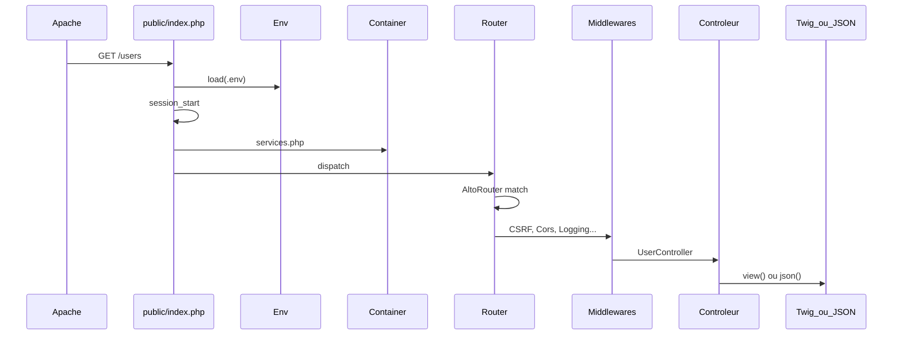

# Comment fonctionne ce framework

Document pédagogique : **lire le code en parallèle**. Rien n’est « magique » : chaque mécanisme tient dans un fichier lisible sous `core/` ou `config/`.

PHP cible : **^8.2**. Installation et lancement : voir le [README](../README.md).

---

## 1. Ce que c’est (et ce que ce n’est pas)

C’est un **MVC minimal** pour comprendre :

| Couche | Rôle |
|---|---|
| **M**odèle | Une classe = une table SQL. Pas d’objets hydratés automatiquement. |
| **V**ue | Twig pour le web uniquement. L’API n’utilise pas de templates. |
| **C**ontrôleur | Reçoit la `Request`, appelle le modèle / le DTO, rend HTML ou JSON. |

**Volontairement absent** (pour l’évaluation SQL et la lisibilité) :

- pas d’ORM (pas de `hasMany`, pas de relations automatiques) ;
- pas de facades statiques à la Laravel ;
- pas de service providers en cascade ;
- pas de classe `Response` : le rendu est dans `Controller::view()` / `ApiController::json()`.

Le SQL reste visible. Le QueryBuilder **porte le nom des clauses SQL**. On inspecte toujours avec `toSql()` et `getBindings()`.

---

## 2. Arborescence (où regarder)

```
public/index.php          ← unique entrée HTTP (front controller)
config/routes.php         ← toutes les routes, web et /api
config/services.php       ← bindings du conteneur (explicites)
config/database.php       ← DSN lu via Env
core/                     ← le « moteur » (à maîtriser)
app/Web/                  ← pages HTML (contrôleurs + vues Twig)
app/Api/                  ← JSON
app/Models/               ← partagés Web + API
app/DTO/                  ← entrée / sortie (pas la table)
app/Middleware/           ← filtres autour du contrôleur
database/migrations/      ← SQL brut up()/down()
framework                 ← CLI (make:*, migrate)
```

Les namespaces PSR-4 : `App\` → `app/`, `Core\` → `core/`, `Console\` → `console/`.

---

## 3. Cycle de vie d’une requête HTTP



Ordre réel dans [`public/index.php`](../public/index.php) :

1. `BASE_PATH` = dossier racine du projet (un niveau au-dessus de `public/`).
2. Autoload Composer.
3. **`Env::load('.env')` en premier** : la base, le préfixe d’URL, le token API.
4. `session_start()` (nécessaire pour flash, CSRF, auth web).
5. Conteneur + [`config/services.php`](../config/services.php).
6. Handlers d’erreurs : page Twig 500 **ou** JSON si le chemin commence par `/api`.
7. `Router::dispatch()`.

Apache (XAMPP) : le [`.htaccess`](../.htaccess) racine envoie tout vers `public/`. [`public/.htaccess`](../public/.htaccess) envoie les URL qui ne sont pas des fichiers vers `index.php`.

---

## 4. `APP_BASE_PATH` (XAMPP)

Sous XAMPP l’URL ressemble à `http://localhost/framework/users`.  
Les routes, elles, sont déclarées `/users`.

`Request::path()` retire le préfixe `APP_BASE_PATH` (ex. `/framework`).  
`View::url()`, `asset()` et `Controller::redirect()` le **rajoutent**.

| Contexte | `APP_BASE_PATH` |
|---|---|
| `htdocs/framework` | `/framework` |
| DocumentRoot = `public/` (Docker, vhost, `php -S -t public`) | *(vide)* |

Sans ça, le CSS et les redirections cassent en sous-dossier.

---

## 5. Routage

Fichier unique : [`config/routes.php`](../config/routes.php).

```php
['GET', '/users/[i:id]', 'App\\Web\\Controllers\\UserController#show'],
```

- `[i:id]` : paramètre entier AltoRouter → `$request->param('id')`.
- Le handler est une **chaîne** `Classe#methode`, pas une closure cachée.
- Le routeur **instancie le contrôleur via le conteneur** (`Container::make`), donc le constructeur peut demander `View`, `Request`, etc.
- Préfixe **`/api`** = JSON (404 JSON, pas de CSRF). Pas de négociation via l’en-tête `Accept`.

CSRF : pour toute route **web** `POST` / `PUT` / `PATCH` / `DELETE`, `CsrfMiddleware` est **ajouté automatiquement** dans `Router` (pas besoin de le répéter dans le tableau).

Pipeline des middlewares : onion (le premier de la liste s’exécute en premier, puis appelle `$next`).

---

## 6. Conteneur (injection de dépendances)

[`core/Container.php`](../core/Container.php) :

- `bind($id, fn (Container $c) => ...)` : nouvelle instance à chaque `make()`.
- `singleton(...)` : une seule instance (PDO, View, Request, Session…).
- `make(Classe::class)` : si pas de bind, **auto-wiring** : on lit le constructeur par réflexion et on résout chaque type objet récursivement.
- Un paramètre scalaire (`string $viewsPath`) **sans valeur par défaut** → exception explicite. D’où le bind de `View` dans `services.php`.

Les **modèles** (`User::all()`) ne passent **pas** par le conteneur : accès statique volontaire, proche du SQL.

---

## 7. Contrôleurs Web vs API

Deux classes de base, deux dossiers, deux namespaces.

**Web** — [`Core\Controller`](../core/Controller.php)

- `view('users/index.twig', $data)` → Twig, dossier `app/Web/Views/`.
- `redirect('/users')` → en-tête `Location` + `APP_BASE_PATH`.
- Flash : `$this->session->flash('success', '...')` lu une fois dans le layout.

**API** — [`Core\ApiController`](../core/ApiController.php)

- `json($data, 200)`, `error($message, 400)`.
- Corps JSON : `Request` le décode si `Content-Type: application/json`.

Chaque action reçoit `Request $request` (le routeur le passe toujours).

---

## 8. Données : modèle, QueryBuilder, DTO

### Modèle

```php
final class User extends Model
{
    protected static string $table = 'users';
}
```

Retourne des **tableaux associatifs**, jamais une entité magique.

```php
User::all();
User::find(1);
User::table()->where('email', '=', $email)->first();
User::query('SELECT * FROM users WHERE id = ?', [1]);
```

### QueryBuilder

Méthodes = SQL : `select`, `where`, `join`, `leftJoin`, `groupBy`, `having`, `orderBy`, `limit`, `offset`, `get`, `first`, `count`, `insert`, `update`, `delete`.

```php
$sql = User::table()
    ->where('email', '=', 'ada@example.com')
    ->orderBy('id', 'DESC')
    ->toSql();
// SELECT * FROM `users` WHERE `email` = ? ORDER BY `id` DESC
$valeurs = /* getBindings() → ['ada@example.com'] */;
```

Les `?` sont des **requêtes préparées** (pas de concaténation de valeurs dans le SQL).

`where('email', $v)` (2 arguments) équivaut à `where('email', '=', $v)`.

### DTO

Pas un modèle. C’est le contrat d’entrée/sortie :

- `UserInputDTO` : `name`, `email` depuis le formulaire ou le JSON.
- `UserOutputDTO` : ce qu’on affiche / renvoie (sans champs internes inutiles).

`fromArray()` hydrate les **propriétés publiques** et vérifie les types PHP. Champ manquant → `ValidationException` (`$e->errors`).

---

## 9. Vues Twig

[`core/View.php`](../core/View.php), layout [`app/Web/Views/layout.twig`](../app/Web/Views/layout.twig).

Fonctions globales :

| Fonction | Rôle |
|---|---|
| `url('/users')` | Chemin public avec `APP_BASE_PATH` |
| `asset('css/app.css')` | `/assets/...` + `?v=filemtime` (cache-bust) |
| `csrf_field()` | `<input hidden name="_csrf">` |

Les assets sont des fichiers statiques dans `public/assets/` (pas de Vite / Webpack).

---

## 10. Session, CSRF, middlewares

- [`Session`](../core/Session.php) : `set` / `get` / `flash` / `getFlash` / `destroy`. Le flash est **consommé à la lecture**.
- CSRF : jeton en session. Le formulaire web **doit** appeler `{{ csrf_field() }}`. L’API n’est pas concernée.
- [`AuthMiddleware`](../app/Middleware/AuthMiddleware.php) : session `user_id` (web) ou `Authorization: Bearer {API_TOKEN}` (API). **Non branché** sur le CRUD démo : à ajouter dans `routes.php` pour l’exercer.
- [`CorsMiddleware`](../app/Middleware/CorsMiddleware.php) : routes `/api`.
- [`LoggingMiddleware`](../app/Middleware/LoggingMiddleware.php) : `storage/logs/app.log`.

---

## 11. Migrations et CLI

```bash
php framework migrate
php framework make:model Post --migration
```

Une migration = un fichier PHP qui **retourne** un objet `up(PDO)` / `down(PDO)` avec du **SQL brut**. Ordre = nom de fichier (horodatage). Table `migrations` pour ne pas réexécuter.

Le binaire [`framework`](../framework) mappe le nom de commande vers une classe dans `console/Commands/`. Stubs dans `console/Commands/stubs/`.

---

## 12. Exemple CRUD `users` (fil rouge)

Même table, même modèle, deux façons de parler HTTP.

| Étape | Web | API |
|---|---|---|
| Liste | `GET /users` + Twig | `GET /api/users` JSON |
| Créer | formulaire POST + CSRF | `POST /api/users` JSON |
| Voir | `GET /users/{id}` | `GET /api/users/{id}` |
| Modifier | POST (les formulaires HTML n’envoient pas PUT) | `PUT` / `PATCH` |
| Supprimer | POST `.../delete` | `DELETE` |

Fichiers à ouvrir dans l’ordre : migration `create_users_table` → `app/Models/User.php` → DTO → `app/Web/Controllers/UserController.php` → vues `users/*.twig` → `app/Api/Controllers/UserController.php`.

---

## 13. Ajouter une ressource (méthode recommandée)

1. `php framework make:model Article --migration`
2. Écrire le `CREATE TABLE` dans la migration, puis `php framework migrate`.
3. `php framework make:dto ArticleInput` et `ArticleOutput` (ou `--model=Article` si la table existe).
4. `php framework make:controller Article` et `make:controller Article --api`.
5. Déclarer les routes dans `config/routes.php` (web **et** `/api/...` séparément).
6. Vues : `php framework make:view articles/index` etc.

Ne pas inventer de relations entre modèles : joindre en SQL (`join` / `leftJoin` / `query()`).

---

## 14. Erreurs et tests

- 404 : HTML `errors/404.twig` ou `{ "error", "status": 404 }` sous `/api`.
- Exception : 500 Twig ou JSON ; `APP_DEBUG=true` affiche le message.
- Tests : `composer test`. Unit = pas de MySQL. Feature = skip si `framework_test` injoignable.

---

## 15. Fichiers « cœur » à annoter / réviser

| Fichier | Question qu’il répond |
|---|---|
| `public/index.php` | Par où commence une requête ? |
| `core/Router.php` | Comment une URL devient un contrôleur ? |
| `core/Container.php` | Qui instancie les classes ? |
| `core/QueryBuilder.php` | Comment le SQL est-il construit ? |
| `core/Model.php` | Où est la table ? |
| `core/Request.php` | Où sont `$_GET` / `$_POST` ? |
| `config/routes.php` | Quelle URL pour quelle action ? |
